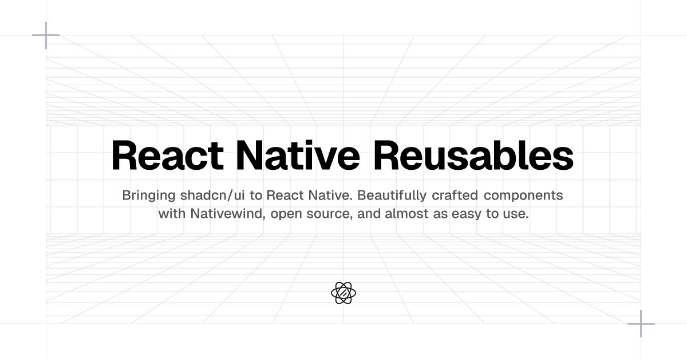

# React Native Reusables

Bringing [shadcn/ui](https://ui.shadcn.com) to React Native. Beautifully crafted components with [Nativewind](https://www.nativewind.dev/), open source, and almost as easy to use.</i>

## Documentation

Visit https://reactnativereusables.com/docs to view the documentation.

## Community Resources

A growing list of community-maintained components, libraries, and templates that build on React Native Reusables and fill in missing shadcn/ui components.  
See [COMMUNITY_RESOURCES.md](./COMMUNITY_RESOURCES.md) for details.

## Contributing

Please read the [contributing guide](/CONTRIBUTING.md).

## License

Licensed under the [MIT license](/LICENSE).

 
 

